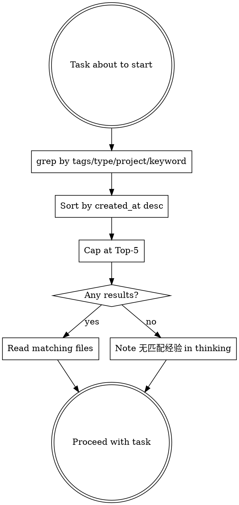

# Agent Experience

## Overview

Cross-project episodic memory for agents. Each experience is one raw, first-person record of a task: what broke, what was tried, what worked, what was decided. Unlike project-compound (which stores synthesized conclusions inside one project), experiences are portable across all projects on this machine.

**Core principle:** One file per experience. INDEX.md is regenerable from frontmatter. Everything is retrievable with plain `grep` + `sort`. No database, no embeddings, no daemon.

Memory layers:

| Layer | What it holds | Where it lives |
|-------|---------------|----------------|
| Working memory | Current conversation | opencode context |
| Episodic memory (this skill) | Raw task experiences, cross-project | `~/.dotfiles/.agent-experiences/` |
| Semantic memory | Synthesized project conclusions | `./docs/agents/knowledge/` via project-compound |

## When to Use

- Before starting a non-trivial task: query for related prior experience
- After completing a non-trivial task: capture the experience as a draft
- Debugging sessions: what failed, what fixed it
- Architecture decisions: options weighed, tradeoffs accepted
- Integration work: library gotchas, version pitfalls

## When NOT to Use

- Trivial changes (typo, single-line, obvious fix)
- Task still in progress
- Harness friction (skill rules, AGENTS.md, hooks) → fix immediately or record here as type: other
- Synthesized semantic knowledge for this project - route to `project-compound ingest`

## Three Operations

| Operation | Purpose | Trigger |
|-----------|---------|---------|
| **capture** | Record a task experience as a draft | Non-trivial task completed |
| **query** | Retrieve related prior experiences | Before starting a non-trivial task |
| **lifecycle** | Manage draft/confirmed/archived/rejected status | Human review, promotion, cleanup |

## Directory Structure

```
~/.dotfiles/.agent-experiences/
  experiences/                  # One markdown file per experience
    {id}.md                     # Flat YAML frontmatter + typed body
  INDEX.md                      # Regenerable catalog (grep output)
  README.md                     # What this store is and how to rebuild it
```

Storage lives in `$HOME/.dotfiles/` so it follows the developer across projects and machines via the dotfiles repo.

## Operation: Capture (semi-auto)

Capture is **semi-automatic**: the agent drafts the experience, a human reviews it, then it becomes confirmed. Never auto-store unreviewed drafts as confirmed.

### Step 1: Dedup check (grep-before-write)

Search existing experiences for the same title, tags, or root cause before writing anything:

```bash
grep -l "keyword" ~/.dotfiles/.agent-experiences/experiences/*.md
grep "^tags:.*<tag>" ~/.dotfiles/.agent-experiences/experiences/*.md
```

If a match exists, update that file or skip; do not create a duplicate.

### Step 2: Generate ID

Format: `YYYYMMDD-HHMMSS-<4hex>` (consistent with worktree timestamp naming).

```bash
date +%Y%m%d-%H%M%S-$(openssl rand -hex 2)
# or without openssl:
date +%Y%m%d-%H%M%S-$(printf '%04x' $RANDOM)
```

### Step 3: Create experience file

Write `experiences/{id}.md` with flat YAML frontmatter (see Schema) and the body template matching its `type`. Set `status: draft`.

### Step 4: Update INDEX.md

Append one line:

```
{id} | {created_at} | {type} | {project} | {title} | {tags}
```

INDEX.md is a cache; it can always be rebuilt (see INDEX Rebuild below).

### Step 5: Human review

Present the draft to the user. The user sets `status: confirmed` or `status: rejected`. The agent never flips its own drafts to confirmed.

### Step 6: Do NOT touch log.md

Unlike project-compound, there is no separate chronological log. The experience files themselves, ordered by `created_at`, ARE the log.

## Operation: Query



Example commands:

```bash
cd ~/.dotfiles/.agent-experiences
# zsh: if store may be empty, run `setopt NULL_GLOB` first (see Empty store note below)

# By type
grep -l "^type: debug" experiences/*.md

# By tag
grep -l "^tags:.*cmake" experiences/*.md

# By project
grep -l "^project: HXProjectTemplate" experiences/*.md

# Newest first, capped at Top-5
# ponytail: sort by created_at (date-only); same-day ties broken arbitrarily — add -k1,1r for filename-timestamp precision if needed
grep -l "^type: debug" experiences/*.md \
  | xargs grep -H "^created_at:" \
  | sort -t: -k3 -r \
  | head -5
```

**Top-5 cap (hard limit):** Never load more than 5 experience files into context, regardless of match count. Retrieval is a hint, not a dump. If more than 5 match, take the 5 newest.

**Zero results:** If nothing matches, the agent MUST note "无匹配经验" in its thinking and proceed. Never silently skip the query step, and never fabricate experience.

**Empty store:** When no experience files exist yet, `experiences/*.md` matches nothing. In bash, grep reports "No such file" and exits (handle with `2>/dev/null`); in zsh, the unmatched glob aborts before grep runs (use `setopt NULL_GLOB` or guard with `ls experiences/*.md 2>/dev/null`). An empty result is the "no prior experience" case — note "无匹配经验" and proceed.

## Operation: Lifecycle

```
draft --(human approves)--> confirmed
draft --(human rejects)---> rejected
confirmed --(stale/superseded)--> archived
```

| Status | Meaning | Queryable? |
|--------|---------|------------|
| draft | Agent-written, awaiting human review | Yes, but flag as unconfirmed |
| confirmed | Human-reviewed, trusted | Yes |
| archived | Was valid, now stale or superseded | Exclude by default |
| rejected | Human rejected, kept for audit | Exclude by default |

**Promotion to semantic memory:** A confirmed experience with general, project-wide applicability can be promoted into `./docs/agents/knowledge/` via `project-compound ingest`. Promotion is a manual human decision, never automatic. Episodic record stays; the semantic wiki gets the distilled conclusion.

## Schema

Flat YAML frontmatter only. Grep-compatible: one key per line, at column 0. NO nested objects, NO multi-line values.

```yaml
---
id: YYYYMMDD-HHMMSS-<4hex>
created_at: YYYY-MM-DD
type: debug | architecture | integration | tool | other
project: <source-project-name>
tags: comma,separated,keywords
status: draft | confirmed | archived | rejected
schema_version: 1
---
```

| Field | Rule |
|-------|------|
| id | `YYYYMMDD-HHMMSS-<4hex>`, matches the filename |
| created_at | `YYYY-MM-DD`, used for sort order |
| type | Exactly one of the five values |
| project | Source project directory name, never omit |
| tags | Comma-separated on ONE line, lowercase, no spaces after commas preferred |
| status | Starts as `draft` |
| schema_version | `1`; bump only on breaking schema change |

## Body Templates

### type: debug

```markdown
# {Title}
## Symptom
## Reproduce
## Hypotheses Tried
## Root Cause
## Fix
## Prevention
```

### type: architecture

```markdown
# {Title}
## Context
## Options Considered
## Decision
## Rationale
## Tradeoffs
```

### type: integration

```markdown
# {Title}
## Library
## What Integrated
## Approach
## Gotchas
```

### type: tool

```markdown
# {Title}
## Tool
## Usage Pattern
## Tips
## Pitfalls
```

### type: other

```markdown
# {Title}
(narrative body)
```

## INDEX Rebuild

INDEX.md is a derived cache. Rebuild it any time from the source of truth (the experience files):

```bash
cd ~/.dotfiles/.agent-experiences
grep -h "^id:" experiences/*.md 2>/dev/null | sort
```

To fully regenerate the table rows, extract the fields per file and join them; the command above is the canonical id listing used to verify consistency.

### Full table rebuild

To reconstruct all INDEX.md rows from experience files:

```bash
cd ~/.dotfiles/.agent-experiences
for f in experiences/*.md; do
  [ -f "$f" ] || continue
  id=$(grep "^id:" "$f" | cut -d' ' -f2)
  date=$(grep "^created_at:" "$f" | cut -d' ' -f2)
  type=$(grep "^type:" "$f" | cut -d' ' -f2)
  project=$(grep "^project:" "$f" | cut -d' ' -f2)
  tags=$(grep "^tags:" "$f" | cut -d' ' -f2-)
  title=$(grep -m1 "^# " "$f" | sed 's/^# //')
  echo "$id | $date | $type | $project | $title | $tags"
done | sort
```

The `[ -f "$f" ] || continue` guards against an empty store where the glob doesn't expand.

## Quick Reference

| Action | How |
|--------|-----|
| Capture experience | Dedup check → gen ID → write `{id}.md` (status: draft) → append INDEX.md → human review |
| Query experience | grep tags/type/project → sort created_at desc → cap Top-5 |
| Confirm a draft | Human edits `status: draft` to `confirmed` |
| Rebuild INDEX | `grep -h "^id:" experiences/*.md 2>/dev/null \| sort` |
| Promote to semantic | `project-compound ingest` (manual decision) |
| Exclude stale/rejected | `grep -L "^status: \(archived\|rejected\)" experiences/*.md` |

## Common Mistakes

| Mistake | Fix |
|---------|-----|
| Paragraphs instead of bullets | One fact per bullet |
| Nested YAML in frontmatter | Flat keys only, one line per key |
| Multi-line YAML values | Keep each value on its single line |
| Absolute project-specific paths in body | Use `./` relative paths, note the `project` field for context |
| Forgetting the `project` field | Always set it; cross-project value depends on it |
| Auto-storing drafts as confirmed | Drafts stay `draft` until a human reviews |
| Skipping the dedup grep-before-write | Always grep for same title/tags first |
| Loading more than Top-5 results | Hard cap at 5, newest first |
| Silently proceeding on zero matches | Note "无匹配经验" explicitly |
| Adding embeddings/vector search/BM25 | grep + sort only, by design |

## Related Docs

- `./docs/agents/core/experience-memory.md` - design rationale for the experience memory system
- `project-compound` skill - semantic memory layer (synthesized project knowledge)
- `~/.dotfiles/.agent-experiences/README.md` - storage layout and rebuild instructions
