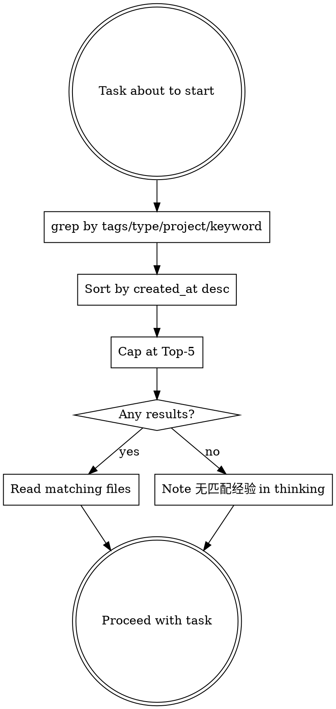
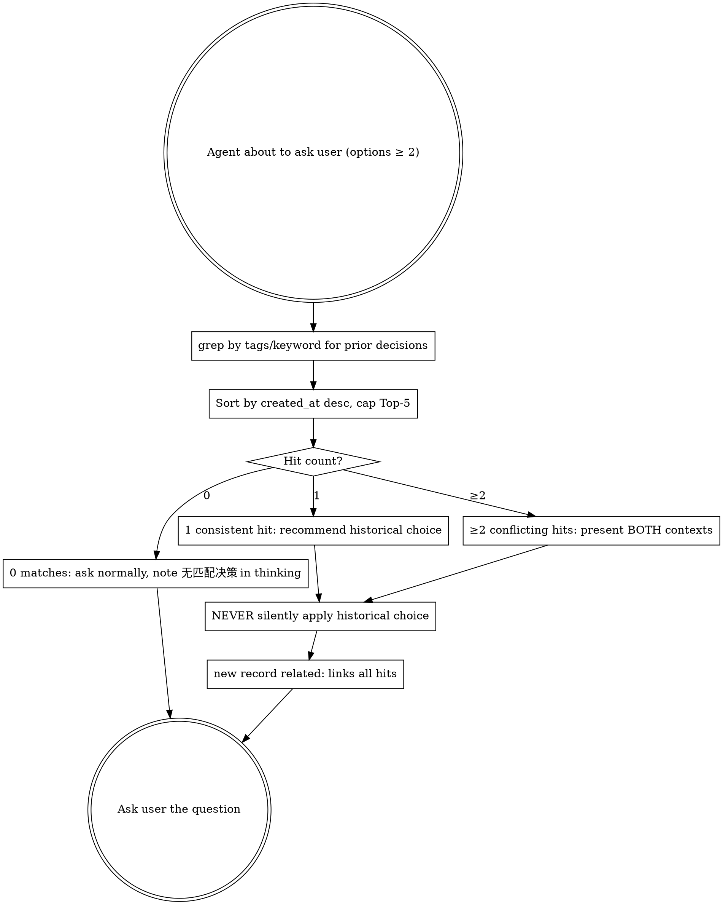

# Agent Experience

## Overview

Cross-project episodic memory for agents. Each experience is one raw, first-person record of a task: what broke, what was tried, what worked, what was decided. Unlike project-compound (which stores synthesized conclusions inside one project), experiences are portable across all projects on this machine.

**Core principle:** One file per experience. INDEX.md is regenerable from frontmatter. Everything is retrievable with plain `grep` + `sort`. No database, no embeddings, no daemon.

Memory layers:

| Layer | What it holds | Where it lives |
|-------|---------------|----------------|
| Working memory | Current conversation | opencode context |
| Episodic memory (this skill) | Raw task experiences, cross-project | `~/.dotfiles/.agent-experiences/` |
| Semantic memory | Synthesized project conclusions | `./docs/agents/knowledge/` via project-compound |

## When to Use

- Before starting a non-trivial task: query for related prior experience
- After completing a non-trivial task: capture the experience as a draft
- Debugging sessions: what failed, what fixed it
- Architecture decisions: options weighed, tradeoffs accepted
- Integration work: library gotchas, version pitfalls

## When NOT to Use

- Trivial changes (typo, single-line, obvious fix)
- Task still in progress
- Harness friction (skill rules, AGENTS.md, hooks) → fix immediately or record here as type: other
- Synthesized semantic knowledge for this project - route to `project-compound ingest`

## Four Operations

| Operation | Purpose | Trigger |
|-----------|---------|---------|
| **capture** | Record a task experience as a draft | Non-trivial task completed |
| **query** | Retrieve related prior experiences | Before starting a non-trivial task |
| **pre-ask query** | Retrieve prior decisions before bothering the user | Agent about to ask a single-choice question with ≥2 options |
| **lifecycle** | Manage draft/confirmed/archived/rejected status | Human review, promotion, cleanup |

## Directory Structure

```
~/.dotfiles/.agent-experiences/
  experiences/                  # One markdown file per experience
    {id}.md                     # Flat YAML frontmatter + typed body
  INDEX.md                      # Regenerable catalog (grep output)
  README.md                     # What this store is and how to rebuild it
```

Storage lives in `$HOME/.dotfiles/` so it follows the developer across projects and machines via the dotfiles repo.

## Operation: Capture (semi-auto)

Capture is **semi-automatic**: the agent drafts the experience, a human reviews it, then it becomes confirmed. Never auto-store unreviewed drafts as confirmed.

### Step 1: Dedup check (grep-before-write)

Search existing experiences for the same title, tags, or root cause before writing anything:

```bash
grep -l "keyword" ~/.dotfiles/.agent-experiences/experiences/*.md
grep "^tags:.*<tag>" ~/.dotfiles/.agent-experiences/experiences/*.md
```

If a match exists, update that file or skip; do not create a duplicate.

### Step 2: Generate ID

Format: `YYYYMMDD-HHMMSS-<4hex>` (consistent with worktree timestamp naming).

```bash
date +%Y%m%d-%H%M%S-$(openssl rand -hex 2)
# or without openssl:
date +%Y%m%d-%H%M%S-$(printf '%04x' $RANDOM)
```

### Step 3: Create experience file

Write `experiences/{id}.md` with flat YAML frontmatter (see Schema) and the body template matching its `type`. Set `status: draft`.

### Step 4: Update INDEX.md

Append one line:

```
{id} | {created_at} | {type} | {project} | {title} | {tags}
```

INDEX.md is a cache; it can always be rebuilt (see INDEX Rebuild below).

### Step 5: Human review

Present the draft to the user. The user sets `status: confirmed` or `status: rejected`. The agent never flips its own drafts to confirmed.

### Step 6: Do NOT touch log.md

Unlike project-compound, there is no separate chronological log. The experience files themselves, ordered by `created_at`, ARE the log.

## Operation: Query



Example commands:

```bash
cd ~/.dotfiles/.agent-experiences
# zsh: if store may be empty, run `setopt NULL_GLOB` first (see Empty store note below)

# By type
grep -l "^type: debug" experiences/*.md

# By tag
grep -l "^tags:.*cmake" experiences/*.md

# By project
grep -l "^project: HXProjectTemplate" experiences/*.md

# Newest first, capped at Top-5
# ponytail: sort by created_at (date-only); same-day ties broken arbitrarily — add -k1,1r for filename-timestamp precision if needed
grep -l "^type: debug" experiences/*.md \
  | xargs grep -H "^created_at:" \
  | sort -t: -k3 -r \
  | head -5
```

**Top-5 cap (hard limit):** Never load more than 5 experience files into context, regardless of match count. Retrieval is a hint, not a dump. If more than 5 match, take the 5 newest.

**Zero results:** If nothing matches, the agent MUST note "无匹配经验" in its thinking and proceed. Never silently skip the query step, and never fabricate experience.

**Empty store:** When no experience files exist yet, `experiences/*.md` matches nothing. In bash, grep reports "No such file" and exits (handle with `2>/dev/null`); in zsh, the unmatched glob aborts before grep runs (use `setopt NULL_GLOB` or guard with `ls experiences/*.md 2>/dev/null`). An empty result is the "no prior experience" case — note "无匹配经验" and proceed.

## Operation: Pre-ask Query

Pre-ask Query 专门服务 `type: decision`：在 agent 向用户抛出一个 ≥2 候选的单选问题**之前**，先查历史同类决策，避免重复打扰用户、复用既有偏好。与任务级 `## Operation: Query`（任务开始前查经验）的区别：Pre-ask Query 是**每次提问前**的细粒度检索，命中后直接影响问题措辞。



**命中分级行为（硬性，逐条对照）：**

| 命中数 | 行为 |
|--------|------|
| 0 matches | 照常提问，thinking 内标注「无匹配决策」，不编造历史；新记录 `related:` 留空 |
| 1 consistent match | 在问题中**显式推荐**历史选择，标注「上次在 \<project\> 选过 X，理由 Y」，用户可一键覆盖 |
| ≥2 conflicting matches | 同时呈现**双方**语境，请用户解释当前偏好；新记录 `related:` 链接全部命中 |

**铁律：NEVER silently apply historical choice.** 即便只有 1 条强一致命中，也必须在问题里明示「这是历史偏好」，由用户确认或覆盖——禁止 agent 自作主张替用户决定。

**跨项目命中（D5）：** agent MUST 读命中记录的 `project:` 与 `## Context`；若技术栈差异显著 → 呈现时标注「仅供参考，未必适用」，绝不当指令套用。匹配仅靠现有 `tags`，不新增匹配字段。

**示例命令（仅筛 decision 类型）：**

```bash
cd ~/.dotfiles/.agent-experiences
# 仅看历史决策，按时间倒序取 Top-5
grep -l "^type: decision" experiences/*.md \
  | xargs grep -H "^created_at:" \
  | sort -t: -k3 -r \
  | head -5
```

## Operation: Capture Decision

与任务级 `## Operation: Capture`（半自动、任务完成后生成 draft、待人类审核）不同：**Capture Decision 是即时的、逐决策的**——用户一选定，agent 立刻落盘一条 `type: decision` 记录，不等任务结束。

**触发条件（同时满足）：**

1. agent 调用提问工具，且 `options.length ≥ 2`；
2. 用户已给出选择（含「选了列表外方案」的情形）。

满足即 capture，每条决策独立成文件，不合并进任务级 summary。

### Step 1: 触发检测

监听自身的提问行为：只要抛给用户的问题含 ≥2 个并列候选、且用户做出了选择，就触发。确认性 Y/N 提问（无真正候选分歧）**不触发**。

### Step 2: 套用 Pre-ask Query 的命中（若有）

若提问前跑过 Pre-ask Query：新记录的 `related:` 字段填入全部命中 ID（0 命中则留空）。链深 ≤ 3 跳，只链直接前驱。

### Step 3: 生成 ID（同 Capture）

```bash
date +%Y%m%d-%H%M%S-$(openssl rand -hex 2)
```

### Step 4: 写文件，套 `type: decision` 模板

按交付物 3 的模板填字段。要点：

- **status 直接写 `confirmed`**：用户刚刚亲手选择 = 已审核（D3）。不走 draft 等待流程，不违反 ECC（ECC 管的是语义层自动升华，不是经验层 status）。
- **Rationale 带 `[inferred]`**：agent 推断的理由一律标 `[inferred]`；用户事后纠正 → 改 `[confirmed YYYY-MM-DD]`。推断与确认分两行，不混写。
- **User-Proposed Alternative（A5）**：用户选了 options 之外方案 → 加 `## User-Proposed Alternative` 小节 + `tags:` 追加 `user-proposed`。
- **敏感决策（A7）**：body 只写决策模式，不写密钥；`tags:` 追加 `sensitive`，跨项目呈现降级。

### Step 5: 更新 INDEX.md

追加一行（与任务级 Capture 同格式，type 列填 `decision`）：

```
{id} | {created_at} | decision | {project} | {title} | {tags}
```

### Step 6: 不另起 log

经验文件本身按 `created_at` 排序即为日志，与任务级 Capture 一致，无独立 log.md。

## Operation: Lifecycle

```
draft --(human approves)--> confirmed
draft --(human rejects)---> rejected
confirmed --(stale/superseded)--> archived
```

| Status | Meaning | Queryable? |
|--------|---------|------------|
| draft | Agent-written, awaiting human review | Yes, but flag as unconfirmed |
| confirmed | Human-reviewed, trusted | Yes |
| archived | Was valid, now stale or superseded | Exclude by default |
| rejected | Human rejected, kept for audit | Exclude by default |

**Promotion to semantic memory:** A confirmed experience with general, project-wide applicability can be promoted into `./docs/agents/knowledge/` via `project-compound ingest`. Promotion is a manual human decision, never automatic. Episodic record stays; the semantic wiki gets the distilled conclusion.

### 定期整理（Periodic Review）

经验库 < 50 条时手动即可，无需 cron/脚本。触发点：每月一次，或每次替换技术栈（库/框架）之后。四步，全部用已有 grep：

```bash
cd ~/.dotfiles/.agent-experiences

# 1. 清草稿：长期停留 draft 的要么 confirm 要么 reject
grep -l "^status: draft" experiences/*.md

# 2. 扫过期：人工读一遍 confirmed，把"早就不用 X 了"的改 status: archived
grep -l "^status: confirmed" experiences/*.md

# 3. 升华普适：跨项目可复用的 confirmed → project-compound ingest，原记录标 archived
# （人工判断，ECC 禁止自动批量 ingest）

# 4. 重建索引
grep -h "^id:" experiences/*.md 2>/dev/null | sort
```

升级触发点：> 50 条加 project 分批过滤；> 200 条才值得写整理脚本（如列出 90 天未被 query 命中的记录）；> 500 条才把 archived 移到 `experiences/archived/` 目录。此前一律用上面的四步。

## Schema

Flat YAML frontmatter only. Grep-compatible: one key per line, at column 0. NO nested objects, NO multi-line values.

```yaml
---
id: YYYYMMDD-HHMMSS-<4hex>
created_at: YYYY-MM-DD
type: debug | architecture | integration | tool | decision | other
project: <source-project-name>
tags: comma,separated,keywords
related: <id1>,<id2>              # 可选；peer 交叉引用，逗号分隔的 experience ID
status: draft | confirmed | archived | rejected
schema_version: 1
---
```

| Field | Rule |
|-------|------|
| id | `YYYYMMDD-HHMMSS-<4hex>`, matches the filename |
| created_at | `YYYY-MM-DD`, used for sort order |
| type | Exactly one of the six values |
| project | Source project directory name, never omit |
| tags | Comma-separated on ONE line, lowercase, no spaces after commas preferred |
| status | Starts as `draft` |
| schema_version | `1`; bump only on breaking schema change |
| related | 可选。逗号分隔的 experience ID（peer 交叉引用，非替代）。只链直接前驱，链深 ≤ 3 跳。默认查询不展开 |

**`related:` vs `Supersedes-candidate:` 语义区分（必读）：**

| 字段 | 语义 | 对被引记录的影响 |
|------|------|------------------|
| `Supersedes-candidate: <id>` | 替代关系（新记录取代旧记录） | 旧记录候选 → `archived` |
| `related: <id1>,<id2>` | peer 交叉引用（同级并列，互不替代） | 不改变任何记录的 status |

`related:` 是软链接，仅用于 Pre-ask Query 命中后的语境串联；不引入并行的 supersession 机制，复用现有 `Supersedes-candidate:` 语义。

## Body Templates

**decision vs architecture 边界（一条规则）：**

- `decision` = 原子单选，一轮用户交互内解决，范围窄（例：「OAuth vs session cookies」「FTS5 vs LIKE」）。
- `architecture` = 多面设计，含 tradeoffs，跨多轮迭代、影响面项目级（例：「导航引擎整体架构」）。
- **启发式**：选项带 (a)(b)(c)(d) 子决策 → architecture；干净的 either/or → decision。
- **同一主题禁止双重记录**：已在 architecture 里决议的子项，不再单独 capture 为 decision；反之 decision 也不升级成 architecture 模板凑字段。

**禁止把 Y/N 问题硬掰成 2-options 以触发 capture：** 只有真正存在 ≥2 个并列候选、且选择会留下可复用偏好的问题，才走 Pre-ask Query + Capture Decision。确认性提问（「这样做可以吗？」）不记录。

### type: debug

```markdown
# {Title}
## Symptom
## Reproduce
## Hypotheses Tried
## Root Cause
## Fix
## Prevention
```

### type: architecture

```markdown
# {Title}
## Context
## Options Considered
## Decision
## Rationale
## Tradeoffs
```

### type: integration

```markdown
# {Title}
## Library
## What Integrated
## Approach
## Gotchas
```

### type: tool

```markdown
# {Title}
## Tool
## Usage Pattern
## Tips
## Pitfalls
```

### type: decision

```markdown
# {Title}
## Decision Point
## Options Considered
## User Choice
## Rationale [inferred]
## Context
## Triggers
## Follow-up Verification
```

字段说明：

- **`## Decision Point`**：一句话点明要解决的单选问题（原子、一轮可解）。例：「POI 全文检索用 FTS5 还是 LIKE」。
- **`## Options Considered`**：≥2 个并列候选，每项一句话要点 + 关键代价。禁止只有 1 个选项（单选项 = 确认，不记录）。
- **`## User Choice`**：用户实际选中的那个候选（原样写候选名，不改写）。
- **`## Rationale [inferred]`**：agent 推断的理由，**必须带 `[inferred]` 标记**。用户随后纠正 → 改标 `[confirmed YYYY-MM-DD]`。推断与确认不可混写。
- **`## Context`**：触发该决策的代码/任务上下文（用 `./` 相对路径，结合 `project:` 字段）。
- **`## Triggers`**：什么场景下应复用此偏好（关键词，便于 Pre-ask Query grep 命中）。
- **`## Follow-up Verification`**：该决策落地的验收点 / 待回看项（可为空，但小节标题必须保留）。

可选小节（命中条件时追加）：

- **`## User-Proposed Alternative`**：用户选了 options 列表之外的方案（见 A5）→ 必加此小节，并在 `tags:` 追加 `user-proposed`（高信号记录）。
- **敏感决策（A7）**：body 只描述决策**模式**，绝不写密钥/口令/内部凭证；`tags:` 追加 `sensitive`，跨项目呈现时降级为「仅供参考」。

### type: other

```markdown
# {Title}
(narrative body)
```

## INDEX Rebuild

INDEX.md is a derived cache. Rebuild it any time from the source of truth (the experience files):

**`related:` 不计入 INDEX 列。** INDEX.md 维持现有 6 列（`id | created_at | type | project | title | tags`）；`related:` 是软交叉引用，不进缓存表，需要时直接 grep 文件本身。

```bash
cd ~/.dotfiles/.agent-experiences
grep -h "^id:" experiences/*.md 2>/dev/null | sort
```

To fully regenerate the table rows, extract the fields per file and join them; the command above is the canonical id listing used to verify consistency.

### Full table rebuild

To reconstruct all INDEX.md rows from experience files:

```bash
cd ~/.dotfiles/.agent-experiences
for f in experiences/*.md; do
  [ -f "$f" ] || continue
  id=$(grep "^id:" "$f" | cut -d' ' -f2)
  date=$(grep "^created_at:" "$f" | cut -d' ' -f2)
  type=$(grep "^type:" "$f" | cut -d' ' -f2)
  project=$(grep "^project:" "$f" | cut -d' ' -f2)
  tags=$(grep "^tags:" "$f" | cut -d' ' -f2-)
  title=$(grep -m1 "^# " "$f" | sed 's/^# //')
  echo "$id | $date | $type | $project | $title | $tags"
done | sort
```

The `[ -f "$f" ] || continue` guards against an empty store where the glob doesn't expand.

## Quick Reference

| Action | How |
|--------|-----|
| Capture experience | Dedup check → gen ID → write `{id}.md` (status: draft) → append INDEX.md → human review |
| Capture a decision | Pre-ask hits → gen ID → write `{id}.md` (status: confirmed, rationale `[inferred]`) → append INDEX.md |
| Query experience | grep tags/type/project → sort created_at desc → cap Top-5 |
| Pre-ask query | grep `type: decision` + tags → sort desc → cap Top-5 → tiered hit behavior (0/1/≥2) |
| Confirm a draft | Human edits `status: draft` to `confirmed` |
| Rebuild INDEX | `grep -h "^id:" experiences/*.md 2>/dev/null \| sort` |
| Promote to semantic | `project-compound ingest` (manual decision) |
| Exclude stale/rejected | `grep -L "^status: \(archived\|rejected\)" experiences/*.md` |

## Common Mistakes

| Mistake | Fix |
|---------|-----|
| Paragraphs instead of bullets | One fact per bullet |
| Nested YAML in frontmatter | Flat keys only, one line per key |
| Multi-line YAML values | Keep each value on its single line |
| Absolute project-specific paths in body | Use `./` relative paths, note the `project` field for context |
| Forgetting the `project` field | Always set it; cross-project value depends on it |
| Auto-storing drafts as confirmed | Drafts stay `draft` until a human reviews |
| Skipping the dedup grep-before-write | Always grep for same title/tags first |
| Loading more than Top-5 results | Hard cap at 5, newest first |
| Silently proceeding on zero matches | Note "无匹配经验" explicitly |
| Adding embeddings/vector search/BM25 | grep + sort only, by design |
| **decision 与 architecture 混记** | 原子单选（一轮、either/or）→ decision；多面设计（含 (a)(b)(c) 子决策、跨多轮）→ architecture。同主题只记一处 |
| **把 Y/N 确认掰成 2-options 凑 capture** | 只有真正 ≥2 并列候选且留下可复用偏好才记录；确认性提问不触发 decision capture |
| **`related:` 链深 > 3 跳** | 只链直接前驱，链深 ≤ 3；超长链说明该走 `Supersedes-candidate:` 或升华为语义记忆 |
| **提问前漏跑 Pre-ask Query** | 凡抛 ≥2 候选单选，必先 grep `type: decision`；0 命中也需在 thinking 标注「无匹配决策」 |
| **把约束当决策 capture** | 外部硬约束（平台限制、API 契约）不是用户选择，记 `type: other` 或不记；decision 只收「本来可走多条路、用户选了一条」的情形 |

## Related Docs

- `./docs/agents/core/experience-memory.md` - design rationale for the experience memory system
- `project-compound` skill - semantic memory layer (synthesized project knowledge)
- `~/.dotfiles/.agent-experiences/README.md` - storage layout and rebuild instructions
