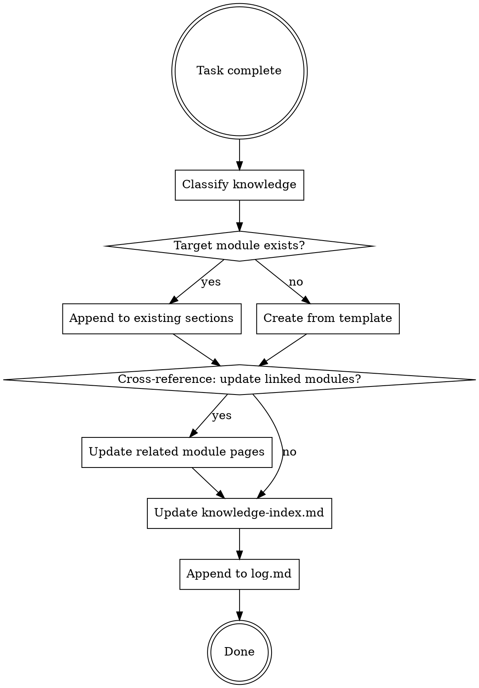
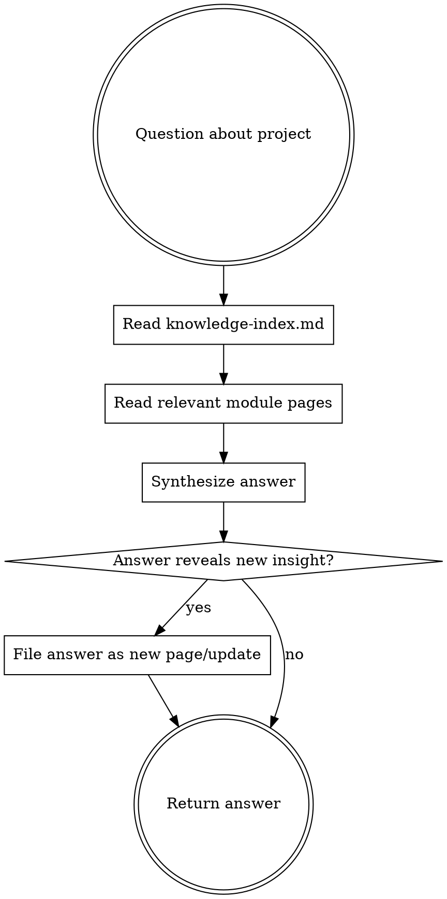

# Project Compound

## Overview

Incremental, compounding knowledge wiki for this project. The LLM builds and maintains a structured wiki that sits between raw experience and future problem-solving. Knowledge is compiled once, cross-referenced, and kept current — not re-derived on every task.

**Core principle:** The wiki is a persistent, compounding artifact. Every completed task makes it richer. Cross-references are already there. Contradictions are flagged. The synthesis already reflects everything learned so far.

## When to Use

- Task completed (feature, bugfix, refactor)
- Design decision with non-obvious tradeoffs
- Bug root cause identified
- Need to query prior knowledge before acting
- Periodic knowledge health check (lint)

## When NOT to Use

- Trivial changes (typo, single-line)
- Task still in progress
- Obvious rationale, no learning value

## Three Operations

| Operation | Purpose | Trigger |
|-----------|---------|---------|
| **Ingest** | Integrate new knowledge into wiki | Task completed, decision made, bug fixed |
| **Query** | Search wiki, synthesize answer, file back | Before acting on unfamiliar module, investigating issue |
| **Lint** | Health-check wiki for drift and gaps | Periodically, or before major work on existing module |

## Directory Structure

```
docs/agents/knowledge/
  knowledge-index.md              # Content-oriented catalog (Layer 1)
  log.md                          # Chronological append-only log
  modules/                        # Module knowledge pages (Layer 2)
    {module-name}.md              # Interlinked, structured per template
```

## Operation: Ingest



### Step 1: Classify Knowledge

After task completion, ask:
- Chose between alternatives? --> Decision
- Used non-obvious approach? --> Strategy
- Found and fixed a bug? --> Bug Experience
- Created/changed module structure? --> Module Info

Multiple types can apply to one task.

### Step 2: Determine Target Module

- Feature on component X --> module name = X
- Cross-cutting concern (auth, error handling) --> use topic name
- Infrastructure (build, CI) --> use `infra`
- Uncertain? Check `./docs/agents/knowledge/knowledge-index.md`

### Step 3: Write Record

#### Module File Template

Create `./docs/agents/knowledge/modules/{module-name}.md`:

```markdown
# {Module Name}

> Last updated: {date}

## Overview
- {brief description}
- Key files: {relative paths}
- Dependencies: {deps}
- See also: [[{linked-module}]]

## Decisions

### {Decision Title} ({date})
- **Chosen:** {what}
- **Alternatives:** {what else}
- **Reason:** {why}
- **Tradeoff:** {what we gave up}
- **Supersedes:** {prior decision, if any}

## Strategies

### {Strategy Title} ({date})
- **Problem:** {what needed solving}
- **Approach:** {what we did}
- **When to reuse:** {similar situations}

## Bug Experience

### {Bug Title} ({date})
- **Symptom:** {what went wrong}
- **Root cause:** {why}
- **Fix:** {what changed}
- **Prevention:** {how to avoid}

## Open Questions
<!-- Gaps that future work should address -->
- {question or unknown}
```

#### Writing Rules

| Rule | Detail |
|------|--------|
| Concise | One bullet per fact, no paragraphs |
| Relative paths | Use `./` prefix for project paths |
| No emoji | Plain text only |
| Date format | YYYY-MM-DD |
| Bilingual OK | Chinese for domain, English for code/tech |
| Append-first | Append by default, revise only when superseding |
| Cross-reference | Add `See also: [[module]]` for related modules |
| Supersede | New decisions that override old ones: add **Supersedes** field, mark old entry with `> **Superseded by:** {new decision} ({date})` |

### Step 4: Cross-Reference

A single ingest may touch multiple wiki pages. Ask:
- Does this decision affect other modules? --> Add `See also` link in those modules
- Does this fix relate to a prior bug in another module? --> Link both
- Does this introduce a dependency? --> Update both modules' Overview

### Step 5: Update Index

When adding a NEW module:

Edit `./docs/agents/knowledge/knowledge-index.md`:
- Add row to "模块列表" table
- Columns: module name, one-line description, summary path, detail directory

### Step 6: Append to Log

Edit `./docs/agents/knowledge/log.md`:

```markdown
## [{date}] ingest | {module-name}
- {1-2 line summary of what was recorded}
- Types: {Decision/Strategy/Bug/Module Info}
```

Log is append-only, parseable: `grep "^## \[" log.md | tail -5` shows last 5 entries.

## Operation: Query



Good answers compound. If a query produces a comparison, analysis, or connection not yet in the wiki — file it back.

## Operation: Lint

Health-check the wiki periodically. Check for:

| Check | What to Look For |
|-------|-----------------|
| Contradictions | Decisions in different modules that conflict |
| Stale claims | Decisions superseded by newer work but not marked |
| Orphan pages | Modules with no inbound `See also` links |
| Missing pages | Concepts referenced but lacking their own module |
| Open questions | `## Open Questions` items that are now resolved |
| Gaps | Important concepts mentioned nowhere in wiki |

Fix issues found. Append lint result to `log.md`.

## Quick Reference

| Action | How |
|--------|-----|
| Ingest after task | Classify → Write → Cross-ref → Index → Log |
| Query knowledge | Read index → Read modules → Synthesize → File back if new |
| Lint wiki | Check contradictions, orphans, gaps → Fix → Log |
| Add cross-reference | `See also: [[module-name]]` in Overview |
| Supersede old decision | Add **Supersedes** in new, mark old with `> **Superseded by:**` |
| Check recent activity | `grep "^## \[" ./docs/agents/knowledge/log.md \| tail -5` |

## Common Mistakes

| Mistake | Fix |
|---------|-----|
| Writing paragraphs | One fact per bullet |
| Absolute paths | Use `./` relative paths |
| Isolated records without links | Always add `See also` cross-references |
| Letting contradictions fester | Supersede explicitly, don't silently overwrite |
| Skipping log.md | Every operation appends to log |
| Query results evaporating | File valuable answers back into wiki |
| Only ingesting, never linting | Periodic lint keeps wiki healthy |
| Recording trivial changes | Only record non-obvious knowledge |

## Related Docs

- `./docs/agents/knowledge/knowledge-index.md` - content index
- `./docs/agents/knowledge/log.md` - chronological log
- `./docs/agents/writing-guide.md` - documentation conventions
- `./docs/agents/index.md` - overall docs structure
