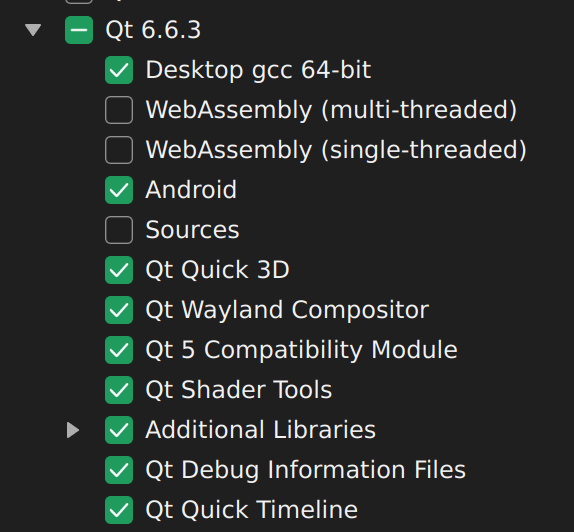

### Qt-Android 开发环境配置

##### 操作系统

Ubuntu 22.04

建议采用最小安装

##### 配置开发环境

```shell
sudo apt install -y \
  build-essential \
  unzip \
  zip \
  libgl1-mesa-dev \
  libglu1-mesa \
  libpulse0 \
  openjdk-17-jdk

cd ~ && tar -xf Android.tar.gz

echo 'export JAVA_HOME=/usr/lib/jvm/java-17-openjdk-amd64' >> ~/.bashrc
echo 'export PATH=$JAVA_HOME/bin:$PATH' >> ~/.bashrc
echo 'export ANDROID_SDK_ROOT=$HOME/Android/Sdk' >> ~/.bashrc
echo 'export ANDROID_NDK_ROOT=$ANDROID_SDK_ROOT/ndk/27.1.12297006' >> ~/.bashrc
echo 'export PATH=$ANDROID_SDK_ROOT/cmdline-tools/latest/bin:$PATH' >> ~/.bashrc
echo 'export PATH=$ANDROID_SDK_ROOT/platform-tools:$PATH' >> ~/.bashrc
```

##### 安装Qt

```shell
./qt-online-installer-linux-x64-4.11.0.run --system-proxy
```

安装Qt SDK 6.6.3 和 QtCreator


