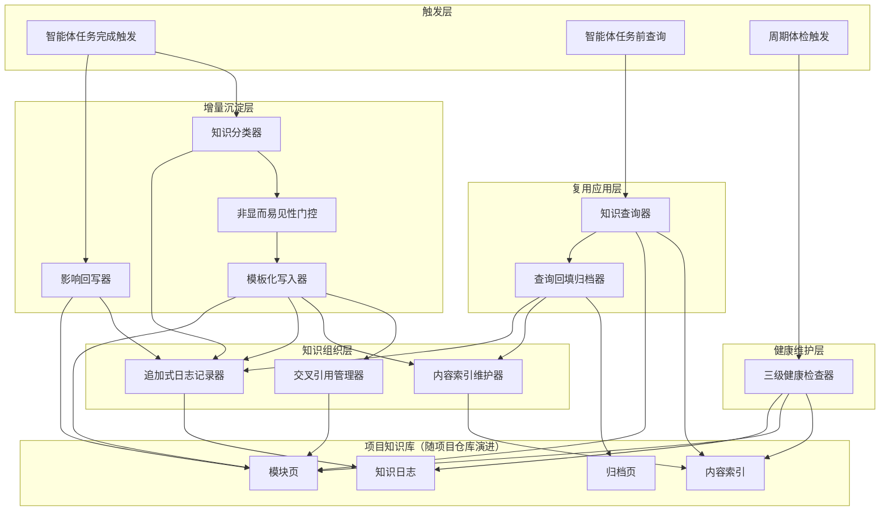
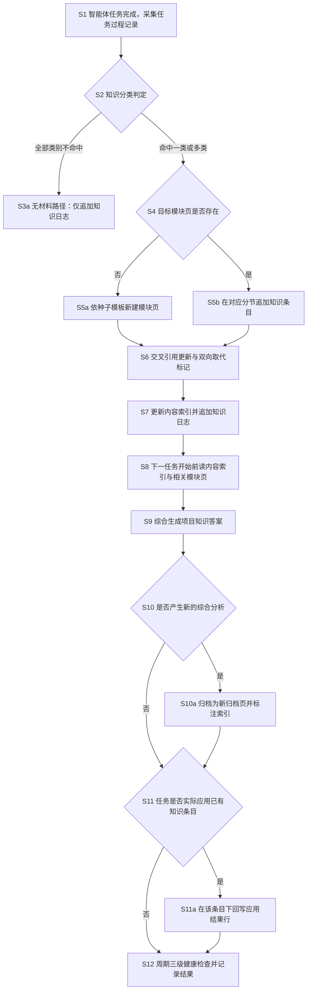

# 技术交底书

**案件名称**：一种面向智能体的项目知识库增量沉淀与复用方法及系统

**技术联系人**：
- 姓名：[待填写]
- 电话：[待填写]
- 邮箱：[待填写]

**专利类型**：发明

---

## 注意事项

（1）交底书应使代理人能看懂，尤其是背景技术和详细技术方案，一定要写得全面、清楚、完整；
（2）技术的公开程度，应以本领域普通技术人员不需付出创造性劳动即可进行实施为准。
（3）在与代理人沟通时，对于代理人咨询的技术问题，应给予回答并认真讲解，并且按要求及时正确地补充相应技术材料。

---

## 一、技术背景与现有技术

### 1.1 现有技术

检索说明：在国家知识产权局专利公布公告系统中，以「知识库」「大语言模型」「智能体」「知识沉淀」等为检索词进行发明公布检索，并在 G06N5 分类号下以「知识沉淀」进行高级查询收口，另自同分类号的首轮检索结果中回补相关条目；各条目的公开文本与著录项均以该系统公布页面为准。

按技术方向分类列举如下。

#### 方向一：任务过程数据驱动的知识沉淀与自进化

（1）CN122635495A《一种基于实验过程数据的实验智能系统自进化与知识沉淀方法及系统》
- 技术方案：获取实验执行过程中产生的实验过程数据；从中抽取成功路径、失败路径及关键参数组合等实验知识；对实验知识进行评价并生成标签、权重和置信度；将经评价的知识存储为包含参数集合、适用条件及版本信息的结构化知识单元；基于结构化知识单元更新决策模型或实验决策策略，并在新实验场景下执行知识迁移与复用。
- 应用场景：实验智能系统的持续自进化。
- 局限性：面向实验过程数据场景，知识单元以参数组合为中心组织；缺少面向软件项目人机协同开发的知识组织方式，未涉及知识条目被实际应用后的有效性回写验证，也无对知识库结构退化的分层治理。
- 来源链接：http://epub.cnipa.gov.cn/patent/CN122635495A

（2）CN122759304A《一种累计优化的冶炼参数知识库构建方法及装置》
- 技术方案：获取转炉炼钢流程中的冶炼全过程数据；获取预设的专家知识规则库与工人经验数据，基于上述数据构建冶炼参数知识库；针对冶炼过程中的目标阶段，基于该知识库进行生产指导。
- 应用场景：转炉炼钢流程的参数指导。
- 局限性：与冶炼领域强绑定，依赖专家规则与经验数据的一次性融合构建；缺少以任务完成为触发的增量沉淀与价值门控，也未涉及知识矛盾管理、知识结构健康检查等治理机制。
- 来源链接：http://epub.cnipa.gov.cn/patent/CN122759304A

#### 方向二：领域专用智能体的经验沉淀与闭环写回

（3）CN122596245A《一种面向水电厂设备历史故障知识沉淀与辅助处置的AI-Agent方法》
- 技术方案：通过数据接入模块采集多源故障数据，经知识结构化模块转化为标准化故障知识单元，由记忆管理层构建多维故障记忆库；技能调用模块执行专业分析操作，模型路由模块适配多种大模型部署模式；问答推理层输出结构化辅助处置结果，闭环写回模块完成经验沉淀。
- 应用场景：水电厂设备（调速器、监控系统等）故障分析与辅助处置。
- 局限性：面向水电运维领域专用；其"闭环写回"仅将本次处置经验写入记忆库，未区分知识条目被再次应用后的实际效果差异（生效、需调整还是失效），也无沉淀前的价值门控与失败路径显式分节沉淀机制。
- 来源链接：http://epub.cnipa.gov.cn/patent/CN122596245A

（4）CN122741144A《一种基于大语言模型的网络安全事件日志智能分析方法》
- 技术方案：从大规模模型知识沉淀与多智能体协同分析的双维视角出发，在大语言模型语义建模基础上引入统一特征表示学习网络、跨模态多头注意力机制、图神经网络可信度评估、结构化剪枝蒸馏及融合因果推理的智能体协同机制，实现安全事件的智能化分析。
- 应用场景：网络安全事件日志分析。
- 局限性：重点在于模型架构与推理协同，知识沉淀仅作为背景视角；未涉及项目内知识库的组织结构、知识有效性反馈与结构治理。
- 来源链接：http://epub.cnipa.gov.cn/patent/CN122741144A

#### 方向三：知识图谱化沉淀与检索生成

（5）CN121706754A《一种基于大模型的运维文档自动生成与知识沉淀方法》
- 技术方案：将结构化数据输入大模型，按故障场景、操作步骤、处理方案、关联组件四个维度识别和抽取知识元素；对同一故障场景的多次处理记录，将未被明确记录的经验性操作单独提取为显性经验知识条目；以故障场景为核心节点建立因果关系、包含关系、时序关系三类连接边，形成知识关联图谱存入知识库；收到文档生成请求时，大模型在图谱中检索匹配节点及关联路径，按预设模板组装生成运维文档。
- 应用场景：运维文档自动生成与运维知识沉淀。
- 局限性：以图谱节点为中心组织知识；查询产物是文档而非沉淀回库，综合分析结果不回填；知识更新依赖图谱扩展，缺少新旧知识显式取代与矛盾标记机制，也无分层健康检查。
- 来源链接：http://epub.cnipa.gov.cn/patent/CN121706754A

（6）CN122757428A《查询信息的方法、相关装置及计算机程序产品》
- 技术方案：利用大语言模型读取问题信息的问题意图及涉及领域；基于问题意图确定问题信息命中的实体；从涉及领域对应的知识图谱的图数据库中提取与实体对应的目标信息，实现对问题信息的知识提取。
- 应用场景：基于知识图谱的智能问答与信息检索。
- 局限性：单向查询，查询产生的综合分析结果不回流知识库；仅有检索侧机制，无沉淀侧、治理侧配套。
- 来源链接：http://epub.cnipa.gov.cn/patent/CN122757428A

**检索总结与本质区别**：检索范围内的现有技术主要呈现三类形态——特定领域内批量构建参数/故障知识库（方向一）、领域专用智能体的经验记忆与写回（方向二）、知识图谱化沉淀与检索生成（方向三）。本发明与上述现有技术的本质区别在于：以软件项目仓库内智能体人机协同开发为对象，以任务完成为触发时机，构建"分类门控的增量沉淀—分层组织与双向取代—查询综合回填归档—应用结果影响回写—三级健康检查"的完整复利闭环；知识不是被一次性批量构建，而是随每次任务增量编译、交叉引用先行、矛盾显式标记、综合答案与原始知识分离存放，并由实际应用结果持续验证知识有效性。

### 1.2 现有技术存在的缺点

综合上述现有技术，存在以下核心缺陷：

（1）**缺少面向软件项目人机协同场景的通用沉淀机制**：现有知识沉淀方案多与实验过程、冶炼、水电运维、网络安全等特定领域绑定，缺少直接作用于软件项目仓库、随代码同库演进的项目知识库沉淀与复用机制。

（2）**无增量价值门控，知识库易积累低价值内容**：现有方案以"数据到知识"的批量抽取或事后写回为主，缺少以任务完成为触发、对平凡变更与非显而易见知识加以区分的门控，长期运行后低价值条目稀释知识库。

（3）**失败路径与成功经验沉淀不对称**：多数方案侧重成功路径与结论性知识，对"尝试过但失败、不应重复"的失败路径缺少与成功经验同等的结构化沉淀位置，导致重复踩坑。

（4）**原始知识与综合结论混淆存放**：查询、对比、综合产生的二次结论或直接蒸发（如单向查询方案），或与原始知识混存于同一结构（如图谱节点），久而久之无法区分"一手材料"与"综合判断"。

（5）**知识矛盾与演化缺少显式管理**：新旧决策冲突时，现有方案或覆盖、或版本化，缺少双向的取代标记，矛盾知识长期并存且无系统化发现手段。

（6）**知识有效性不可知、结构退化无治理**：知识条目被实际使用后是否仍然生效无反馈通道；索引缺口、断链、孤儿页、已解决的开放问题等结构退化无分层检查与修复机制。

---

## 二、本发明所要解决的技术问题

针对上述缺点，本发明所要解决的技术问题是：

（1）**任务经验流失与重复推导问题**：智能体与开发人员在项目中形成的决策、策略、缺陷经验与失败教训，随任务结束而流失，后续任务被迫从零重新推导；本发明提供以任务完成为触发、分类门控的增量沉淀与查询复用闭环，使项目知识库成为随任务增长的复利资产。

（2）**知识库质量退化问题**：无门控的沉淀会积累仪式化低价值内容，新旧知识矛盾发酵、结构漂移；本发明提供非显而易见性门控、双向取代标记与三级健康检查，抑制噪声、显式管理演化、治理结构退化。

（3）**综合结论蒸发与知识有效性不可知问题**：查询综合产生的跨模块分析无处沉淀、任务实际应用知识后的效果无反馈；本发明提供查询回填归档机制（综合答案独立成页、不混入原始知识）与影响回写机制（应用结果回写为生效、需调整、失效），使知识库自我验证、持续可信。

---

## 三、本发明技术方案的详细阐述

### 3.1 背景

**场景与参与者**：本发明应用于软件项目的人机协同开发场景。参与者在同一项目仓库内协同工作：智能体（基于大语言模型构建、能读取项目文件、执行任务与代码变更的自动化开发代理）承担特性开发、缺陷修复、重构与调查类任务；开发人员负责任务分派、方案评审与关键决策确认。项目知识库以文件形式存放于项目文档目录内，与代码同仓库、同版本管理演进。

**标题对象如何进入系统**：智能体从项目的任务清单文件中领取任务并执行；当任务完成（或任务清单条目全部完成、设计决策确定、缺陷根因查明）时，触发针对该任务的知识增量沉淀流程；智能体在开始下一个任务前，经查询入口检索项目知识库，读取内容索引与相关模块页获得先验知识。项目知识库由此随每次任务增量生长。

**高频术语的场景定义**（全文同词）：
- **知识条目**：一次沉淀的最小知识单元，即一条有明确来源的决策、策略、缺陷经验或失败路径记录。
- **模块页**：按模块或主题组织的结构化知识页面，含固定分节：概览、决策、策略、缺陷经验、失败路径、开放问题；每条目自带来源字段（代码提交哈希、任务文件路径或会话标识）。
- **内容索引**：全库目录表，每行为一个模块或归档页，字段含模块名、一句话描述、摘要路径、详情目录。
- **知识日志**：按时间追加的操作记录，每条以"日期＋操作类型＋模块名"开头的固定格式书写，可按行前缀检索最近若干条操作。
- **归档页**：查询综合产生的新答案所形成的独立页面，只新建、不并入任何模块页（归档是综合答案，不是一手材料）。
- **影响回写**：任务实际应用了某条已有知识条目时，在该条目下追加一行应用结果记录（生效、需调整或失效）。
- **取代标记**：新决策覆盖旧决策时，在新条目标记"取代"，同时在旧条目标记"被取代"，双向成对出现。
- **三级健康检查**：对知识库的分层体检：第一级安全项自动修复，第二级决策类问题只报告不自动修改，第三级结构类问题只报告。

### 3.2 系统框图

本发明系统由触发层、增量沉淀层、知识组织层、复用应用层、健康维护层及项目知识库构成，整体结构如图 1。

### 3.3 模块功能说明

（1）**智能体任务完成触发**（触发层）：捕获智能体任务收尾信号，包括任务完成、任务清单条目全部勾选、设计决策确定、缺陷根因查明等触发时机；采集任务过程记录（代码变更记录、决策与备选方案、缺陷修复过程、任务清单勾选状态），作为增量沉淀与影响回写的输入。与知识分类器、影响回写器衔接。

（2）**智能体任务前查询**（触发层）：在智能体开始任务前发起知识查询请求，驱动知识查询器工作；查询所得综合答案作为任务先验知识注入任务上下文。

（3）**周期体检触发**（触发层）：按周期或在大型任务开始前，触发三级健康检查器对项目知识库体检。

（4）**知识分类器**（增量沉淀层）：对任务过程记录做知识分类判定，类别集合为{决策（在备选间做了取舍）、策略（采用了非显而易见做法）、缺陷经验（查明并修复了缺陷）、失败路径（尝试了不应重复的失败做法）、模块信息（变更了模块结构）、任务归档（完成了一个任务计划的全部步骤）}；一个任务可命中多类。平凡变更（如文案单行修改、理由显而易见）全部不命中。分类结果同时决定日志条目的类型标注。

（5）**非显而易见性门控**（增量沉淀层）：在分类判定基础上做价值门控——全部类别不命中时走"无材料路径"，仅在知识日志追加一条日志条目（类型标注为无材料），跳过写入模块页，从源头抑制仪式化低价值内容；命中任一类别才放行至模板化写入器。

（6）**模板化写入器**（增量沉淀层）：按目标模块页的固定分节模板写入知识条目：条目按类别进入决策、策略、缺陷经验、失败路径等对应分节；决策类条目记录来源、所选方案、被弃备选、选择理由、付出的代价、所取代的旧决策等字段；失败路径类条目记录问题、尝试内容、失败原因、不要再重复的告诫。目标模块页不存在时，先按种子模板新建（首次使用时创建内容索引、知识日志、模块页目录、归档页目录的种子结构，已存在则跳过），再写入。

（7）**影响回写器**（增量沉淀层）：任务过程中实际应用了某条已有知识条目（策略被复用、缺陷经验被规避）时，在任务关闭环节于该条目下追加一行影响回写记录：应用日期、所用任务、结果（生效、需调整、失效）；仅在真实应用时回写，禁止空回写。无真实应用的任务不产生回写记录。

（8）**交叉引用管理器**（知识组织层）：维护模块页之间的双向关联链接（在概览分节登记"参见"关系）；本任务决策影响其他模块时，同步更新受影响模块页的关联；新旧决策冲突时执行双向取代标记——新条目标记"取代"，旧条目回标"被取代"并注明取代者，保证取代关系成对、可追溯。

（9）**内容索引维护器**（知识组织层）：新增模块页时在内容索引表追加一行（模块名、一句话描述、摘要路径、详情目录）；归档页入索引时在描述前加"已归档"前缀标注，与普通模块页区分。

（10）**追加式日志记录器**（知识组织层）：每次操作（沉淀、查询、回填、回写、体检）都在知识日志追加一条固定格式条目："日期＋操作类型＋模块名"开头，后接一至两行摘要与类型标注；日志只追加不修改，可按行前缀检索最近若干条操作，实现操作可追溯。

（11）**知识查询器**（复用应用层）：收到项目相关问题后，先读内容索引定位相关模块，再读相关模块页，最后综合生成答案；综合内容为跨模块对比、分析或联系的判断。

（12）**查询回填归档器**（复用应用层）：对综合答案做回填判定——产生了库中尚不存在的对比、分析或跨模块联系时，将答案整理为新的归档页（只新建、不并入任何模块页），同步在内容索引登记（带"已归档"前缀）并在知识日志追加条目；无新知则不回填。由此查询答案复利沉淀，同时保持原始知识与综合结论分离。

（13）**三级健康检查器**（健康维护层）：对项目知识库做分层体检。第一级（安全项，自动修复）：索引缺口（库中有文件而索引缺行）自动补行并标注占位；死索引条目（索引有行而文件不存在）仅在描述前加"缺失"前缀、永不删行；更新漂移（索引行与模块页概览不一致）以页面为准同步索引。第二级（决策项，只报告不自动修改）：断开的关联链接、不对称的取代标记（有"取代"无"被取代"或反之）、失效的来源引用、不同模块间的矛盾决策、已被新工作取代但未标记的过时断言。第三级（结构项，只报告）：无任何入链的孤儿页、被引用但缺页的概念、已解决但未关闭的开放问题、重要概念无处沉淀的缺口。检查结果（问题数与自动修复数）追加进知识日志；不可修复项保持报告状态，不以编造内容或链接的方式强行修复。

### 3.4 系统流程说明

本发明方法在一次任务生命周期内的整体流程如图 2，步骤 S1—S12 与图中节点一一对应。

**S1 智能体任务完成，采集任务过程记录**：任务完成触发器捕获收尾信号，采集代码变更记录、决策与备选方案、缺陷修复过程、任务清单勾选状态，形成本次沉淀的原始输入。

**S2 知识分类判定**：知识分类器按类别集合{决策、策略、缺陷经验、失败路径、模块信息、任务归档}逐项判定，一个任务可命中多类；判定结果决定后续写入的分节位置与日志类型标注。

**S3a 无材料路径**：全部类别不命中（平凡变更、理由显而易见）时，仅在知识日志追加一条类型为"无材料"的日志条目，跳过 S4—S7 的写入环节，从源头抑制低价值内容。

**S4 目标模块页是否存在**：按定位规则确定目标模块页——特性属于某组件则定位于该组件模块；横切关注（如错误处理、权限）定位于主题模块；基础设施（构建、持续集成）定位于基础设施模块；文档类变更按文件主题定模块。目标模块页不存在则转 S5a，存在则转 S5b。

**S5a 依种子模板新建模块页**：首次沉淀前完成引导检查——内容索引、知识日志、模块页目录、归档页目录四类种子文件只创建缺失的、绝不覆盖已存在的；随后按模块页模板新建页面。

**S5b 在对应分节追加知识条目**：知识条目写入目标模块页对应分节，首字段为来源（代码提交哈希、任务文件路径或会话标识）；默认追加、不重写旧条目，仅在新条目取代旧决策时按 S6 处理。

**S6 交叉引用更新与双向取代标记**：本任务决策影响其他模块时，在受影响模块页登记关联链接；新决策覆盖旧决策时，新条目标记"取代"、旧条目标记"被取代"，双向成对。

**S7 更新内容索引并追加知识日志**：新增模块页时在索引表补行；知识日志追加"日期＋操作类型＋模块名"格式的沉淀条目。

**S8 下一任务开始前读内容索引与相关模块页**：智能体任务前查询触发，知识查询器先读内容索引定位相关模块，再读模块页内容。

**S9 综合生成项目知识答案**：基于相关模块页内容，综合出面向当前问题的答案，重点产出跨模块的对比、分析与联系。

**S10 回填判定**：综合产生了库中尚不存在的对比、分析或跨模块联系时转 S10a；否则答案直接返回任务上下文使用。

**S10a 归档为新归档页并标注索引**：查询回填归档器将答案整理为新的归档页（只新建、不并入模块页），内容索引登记并加"已归档"前缀，知识日志追加查询归档条目。

**S11 影响回写判定**：任务过程中实际应用了已有知识条目时转 S11a；否则转 S12。

**S11a 在该条目下回写应用结果行**：影响回写器在所应用条目下追加一行：应用日期、所用任务、结果（生效、需调整、失效）。

**S12 周期三级健康检查并记录结果**：按周期或大任务前触发，第一级安全项自动修复（索引补行、缺失前缀、漂移同步），第二级决策项与第三级结构项只报告；检查结果以"发现问题数、自动修复数"及逐条明细追加进知识日志，形成沉淀—复用—验证—治理的完整闭环。

### 3.5 关键技术参数

| 参数 | 含义 | 取值 / 说明 |
|------|------|-------------|
| 知识类别集合 | 知识分类判定的类别空间 | {决策, 策略, 缺陷经验, 失败路径, 模块信息, 任务归档}；一个任务可命中多类 |
| 非显而易见性门控判据 | 判定是否为可沉淀知识的六个问题 | 是否在备选间取舍；是否采用非显而易见做法；是否查明并修复缺陷；是否尝试了不应重复的失败做法；是否变更模块结构；是否完成任务计划全部步骤；全部否即为无材料 |
| 影响回写结果取值 | 知识条目被实际应用后的效果标注 | {生效, 需调整, 失效} 三值 |
| 健康检查分级 | 体检的处置级别 | 第一级自动修复（索引缺口、死索引条目、更新漂移）；第二级只报告（断链、不对称取代、失效来源、矛盾决策、过时断言）；第三级只报告（孤儿页、缺页、已解决开放问题、概念缺口） |
| 知识日志条目格式 | 日志可解析性的保证 | 每条以"日期＋操作类型＋模块名"开头；操作类型含沉淀、查询、回填、回写、体检；按行前缀可检索最近条目 |
| 条目来源字段 | 每条知识条目的必带首字段 | 代码提交哈希、任务文件路径或会话标识三者其一；无可引用来源时不得以占位符充数 |
| 内容索引行字段 | 索引表结构 | 模块名、一句话描述、摘要路径、详情目录；归档页描述前加"已归档"前缀，死条目加"缺失"前缀且永不删行 |
| 模块页固定分节 | 模块页模板结构 | 概览、决策、策略、缺陷经验、失败路径、开放问题 |
| 写入策略 | 条目写入方式 | 默认追加不重写；仅显式取代时做双向标记 |
| 回填原则 | 归档页与模块页的关系 | 归档页只新建、永不并入模块页 |

---

## 四、与现有技术相比，本发明具有的优点

概括而言，本发明把项目知识库从"被动存储"变为"随任务增长的复利资产"：知识一次编译、交叉引用先行、矛盾显式标记、综合结论分离归档、应用结果持续验证。分点详述：

（1）**增量沉淀替代批量构建**：以任务完成为触发、以类别判定加非显而易见性门控放行，知识随每次任务增量编译进库，无需离线批量构建，与检索范围内以批量数据抽取构建知识库的方案（方向一）相比，天然贴合软件项目持续演进的形态。

（2）**低价值内容源头抑制**：无材料路径使平凡变更只留一行日志、不产生模块页条目，控制知识库信噪比，克服现有方案无门控写回导致的噪声积累问题。

（3）**失败路径与成功经验对称沉淀**：失败路径作为一级知识类别拥有独立分节与专门字段（问题、尝试内容、失败原因、不要再重复），与决策、策略同等沉淀，避免同类失败重复发生。

（4）**原始知识与综合结论双层分离**：查询综合答案只归档为新页、永不并入模块页，索引以"已归档"前缀区分；一手材料与综合判断始终可分辨，克服图谱化方案中综合结论与原始知识混存的缺陷。

（5）**矛盾显式管理**：双向取代标记（取代与被取代成对出现）配合健康检查中的不对称检测，使知识演化可追溯、矛盾不发酵，优于覆盖式或仅版本化的更新方式。

（6）**知识有效性闭环验证**：影响回写机制以三值结果（生效、需调整、失效）记录每条知识被真实应用的效果，使陈旧知识可被识别，克服现有"闭环写回"只增不验的局限。

（7）**结构退化分层治理**：三级健康检查按"安全自动修复、决策报告、结构报告"分级处置，且不可修复项保持报告而不编造修复，兼顾自动化效率与知识安全；检查结果全部入日志，可审计。

---

## 五、本发明的技术关键点和欲保护点

（1）**任务触发的分类门控增量沉淀机制**：对智能体任务完成信号触发的任务过程记录执行六类知识分类判定与非显而易见性门控；全部不命中时仅追加无材料日志条目、跳过写入，命中时放行至模板化分节写入（输入：任务过程记录；判定：六问门控；输出：分节条目或日志条目）。

（2）**分层知识组织结构**：内容索引（目录表）＋模块页（固定分节模板）＋归档页（综合答案独立存放）＋知识日志（追加式可解析记录）四要素构成的项目知识库组织方式，随项目仓库同库演进。

（3）**双向取代的矛盾知识演化标记机制**：新决策条目标记"取代"字段、旧条目回标"被取代"标注，成对出现；配合不对称取代检测（有取代无被取代或反之即报告）实现矛盾知识的显式管理。

（4）**查询综合答案只归档不合入的回填机制**：查询综合产生新的对比、分析或跨模块联系时，整理为新的归档页并在内容索引以"已归档"前缀登记，永不并入模块页；综合结论与原始材料分离存放。

（5）**知识应用影响回写机制**：任务实际应用已有知识条目时，在该条目下追加应用日期、所用任务、三值结果（生效、需调整、失效）的回写行；仅真实应用才回写，形成知识有效性验证反馈环。

（6）**三级知识健康检查机制**：第一级安全项自动修复（索引缺口补行并标注占位、死索引条目加缺失前缀且永不删行、索引漂移以页面为准同步）；第二级决策项只报告（断链、不对称取代、失效来源、矛盾决策、过时断言）；第三级结构项只报告（孤儿页、缺页、已解决开放问题、概念缺口）；检查结果以问题数与修复数记入知识日志。

（7）**追加式机器可解析日志与操作可追溯**：每次沉淀、查询、回填、回写、体检操作均以"日期＋操作类型＋模块名"固定格式追加日志，支持按行前缀检索最近操作，实现全库操作可追溯。

---

## 六、其它

### 实施例一：网关服务模块的特性开发沉淀（主路径）

某支付清结算项目的「网关服务模块」需要为外部接口调用增加超时重试能力。智能体从任务清单领取该特性任务，任务前查询读到「链路稳定性」模块页中登记的既有重试讨论，任务中完成实现：在指数退避与固定间隔两种重试方式间选择了指数退避。

任务完成触发沉淀流程：知识分类器判定命中"决策"类（在备选间取舍）；门控放行。模板化写入器定位目标模块页「网关服务模块」已存在，在"决策"分节追加条目，字段为：来源（代码提交哈希）、所选方案（指数退避重试）、被弃备选（固定间隔重试）、选择理由（外部接口偶发抖动，退避可避免重试风暴）、代价（首次重试延迟略增）、取代（无）。交叉引用管理器在「链路稳定性」模块页登记与「网关服务模块」的关联链接。内容索引无新增模块、不需补行；知识日志追加条目"日期＋沉淀＋网关服务模块"。

### 实施例二：消息推送模块改造的查询回填与影响回写（分支路径）

智能体接手「消息推送模块」的重复消息防护改造。任务前查询：读内容索引定位到「网关服务模块」与「数据访问模块」两页；知识查询器综合两页的重试策略决策与唯一性约束决策，产出跨模块对比分析——两种防护路线（重试侧幂等防护与存储侧唯一约束防护）的适用条件与代价对比。该对比为库中尚不存在的新综合分析，查询回填归档器将其整理为归档页「重复消息防护方案对比」，内容索引登记并加"已归档"前缀，知识日志追加查询归档条目。

任务执行中，智能体实际采用了归档页中"存储侧唯一约束防护"路线并在存储层落地唯一索引；任务关闭时影响回写器在「数据访问模块」对应策略条目下追加回写行：应用日期、所用任务（重复消息防护改造）、结果（生效）。至此一条知识完成了"沉淀—检索—综合—归档—应用—回写验证"的全生命周期。

### 实施例三：周期健康检查与取代标记（治理分支）

周期体检触发三级健康检查：第一级发现「数据访问模块」新增了「连接池上限调整」决策条目但内容索引缺行，自动补行并标注占位描述；发现「网关服务模块」决策分节出现新旧两条重试策略且新条目标记"取代"而旧条目漏标"被取代"，第二级报告该不对称取代（只报告、不自动修改），由开发人员确认后补标；第三级报告归档页「重复消息防护方案对比」当前无任何入链，提示补建关联。同日一次单行文案修改经分类判定全部类别不命中，走无材料路径，知识日志仅记一条"无材料"条目。检查结果以"发现 4 项问题、自动修复 1 项"及明细入知识日志。

### 技术效果

（1）项目知识一次编译、持续复用，后续同类任务不再从零推导，任务前综合检索直接给出跨模块先验结论；
（2）失败路径显式沉淀后，同类失败可通过任务前查询直接规避；
（3）门控使平凡变更不产生知识条目，知识库信噪比长期可控；
（4）双向取代与三级健康检查使矛盾可发现、演化可追溯、结构退化可治理；
（5）影响回写使知识的实际有效性随使用持续更新，陈旧知识可被识别淘汰；
（6）全操作日志化，知识库的每一次变化可审计、可回放。

### 参数设置示例（不作为权利要求限制）

知识类别集合与门控六问按 3.5 节所列全集使用；健康检查按每周期执行一次、或大型任务开始前执行；知识日志条目摘要保持一至两行；模块页条目字段按 3.3 节模板字段取用；影响回写仅在任务真实应用条目时产生。上述参数可根据项目规模与团队节奏调整。
